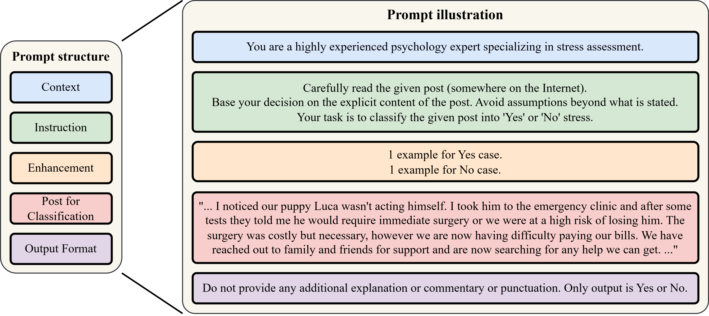
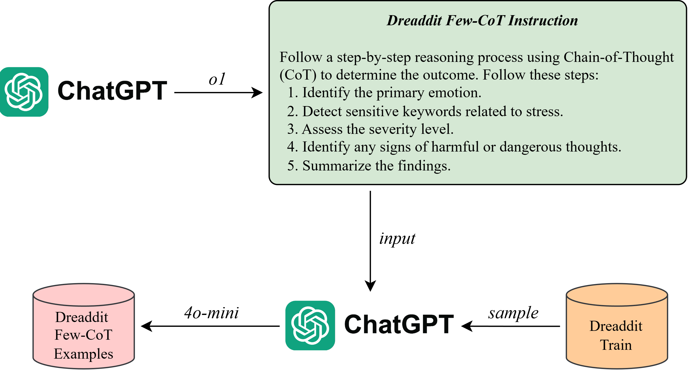
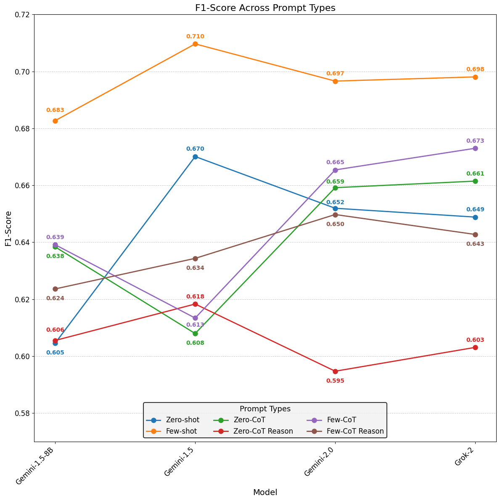
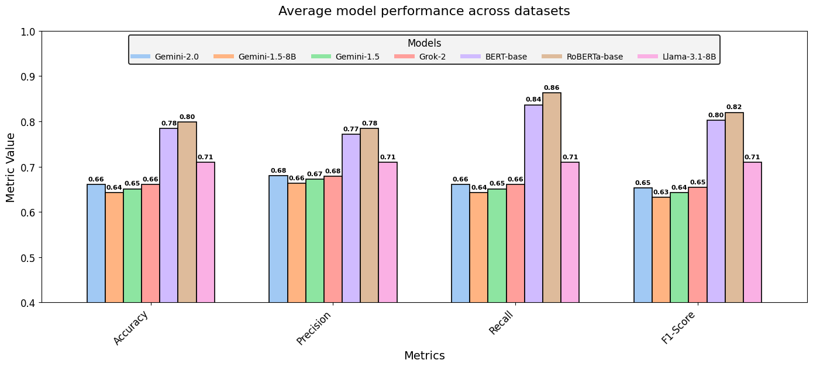

# RESEARCH ON PROMPTING TECHNIQUES AND LANGUAGE MODELS FOR DETECTING PSYCHOLOGICAL STATES FROM SOCIAL MEDIA POSTS

**Authors**: 
- Khoi Nguyen Anh
- Tuong Nguyen Vu
- Cuong Le Anh, PhD

**Organization**: Faculty of Information Technology, Ton Duc Thang University, Ho Chi Minh City, Vietnam

## ABSTRACT
This study focuses on exploring the effectiveness of large language models (LLMs) and prompting techniques in the binary classification of psychological issues (stress, thwarted belongingness, suicidal intent) based on social media posts. We designed a generalized prompt structure consisting of five components, implemented across various variants (Zero-shot, Few-shot, Chain-of-Thought). Additionally, we fine-tuned LLMs (Gemini, Grok, LLaMA) using methods such as LoRA and compared them with fine-tuned BERT/Transformer models (BERT-base, RoBERTa-base). The results indicate that Few-shot prompting generally achieves higher F1-scores compared to Zero-shot, while Chain-of-Thought improves performance in some models; however, the "Reason" variant sometimes introduces noise. Notably, fine-tuned LLMs can approach or even compete with RoBERTa-base, yet smaller BERT/Transformer models remain more stable when handling sensitive data. The study concludes that, for LLMs to reach their full potential, deep fine-tuning combined with specialized prompting strategies is required.

<div align="center">
  
</div>
Illustration of the prompt structure with five main components: (1) Context, (2) Instruction, (3) Enhancement, (4) Post for Classification and (5) Output Format.

## Installation
Instructions for installing the necessary tools, libraries, and environment to run the code.

### 1. Create a Conda Environment
First, create a new Conda environment:

```bash
conda create -n myenv python=3.8
conda activate myenv
```

### 2. Install Required Libraries
Install the required libraries from the `requirements.txt` file:

```bash
pip install -r requirements.txt
```

If you have an `environment.yml` file, you can create the environment from it:

```bash
conda env create -f environment.yml
conda activate myenv
```

## Data
See the `datasets` folder for the datasets used and `readme.md` for dataset sources.
For CoT example, access the `datasets/clean/CoTExample` folder for more details. The figure below illustrates the pipeline for generating CoT examples.

<div align="center">
  
</div>

## Results
<div align="center">
  
</div>
Comparison of the average F1-score across six types of prompts (Zero-shot, Few-shot, Zero-CoT, Zero-CoT Reason, Few-CoT, Few-CoT Reason) for four models (Gemini-1.5 B8, Gemini-1.5, Gemini-2.0, Grok-2) on the binary classification task across three datasets (Dreaddit, SDCNL, Irl_Belong).

<div align="center">
  
</div>
Comparison of the average performance of the models across three datasets (Dreaddit, IRF_Belong, and SDCNL) based on four key metrics (Accuracy, Precision, Recall, and F1-Score).

## Contact
For any inquiries, please contact:
- **Khoi Nguyen Anh**: [devkoi2k3@gmail.com](mailto:devkoi2k3@gmail.com)